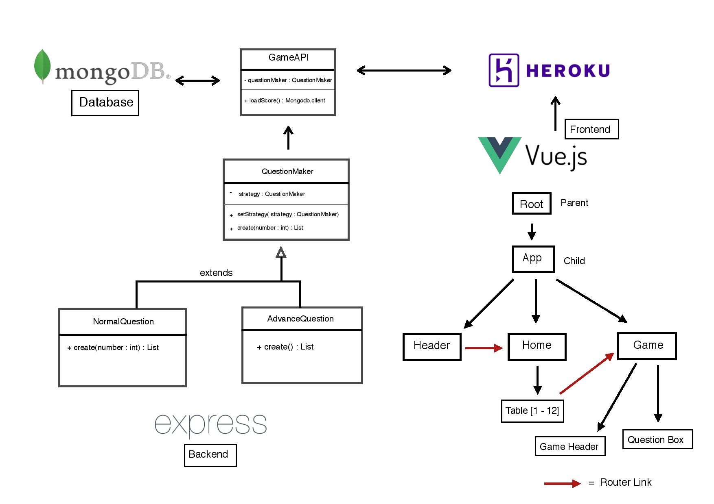

# Complex Math Game

A very simple math game with complex development.

## Prerequisites

1.  Node.js version 3 or above.

## Installation

1. Clone the repository then move into the cloned file.

``` 
$ git clone https://github.com/theworstteam/complex-math-game.git

$ cd complex-math-game
 ```

2. Install npm packages.

```
$ npm install
```
## Run Application Locally

1. Run backend server.

```
$ npm run dev
```
You should see something like this.
```
[nodemon] 1.18.11
[nodemon] to restart at any time, enter `rs`
[nodemon] watching: *.*
[nodemon] starting `node server/index.js`
Server started on port 5000
```
2. Move to client folder.
```
$ cd client
```
3. Run frontend server.
```
$ npm run serve
```
You should see something like this.
```
App running at:
- Local:    http://localhost/8080/
- Network:  <This depends on your connection>

Note that the development build is not optimized.
To create a production build, run npm run build.
```
The website should open automatically.
If not then use the local link above.

## UML diagram



## GRASP document

> 1. High cohesion 
- QuestionMaker have an attribute called strategy, and the class is extend by NormalQuestion and AdvanceQuestion.  Both the superclass and subclass should be close to each other. So we strive for high cohesion and bind all related code together as close as possible.

> 2. Low Coupling 
- QuestionMaker is make to loose coupling between the sub question and the API. If there's no QuestionMaker,the GameAPI will depends too much on those sub class and it will be hard to make improvements in future. 

> 3. Indirection 
- GameAPI looses coupling between model and view directly. It acts like a mediator, view does not get object from model directly but through requests by get APIs. Moreover, view does not access the database directly. Any actions must be done by requests in GameAPI.

> 4. Controller 
- A single Vue file consist of html, javascript, and css. Which means that each Vue file has the controller in itself written in javascript.
```
example for Controller by Vue structure.

<template>
   <p> {{ greeting }} world! </p>
</template>

<script>
   module.exports = {
       data: function() {
           retutn {
               greeting: 'Hello'
           }
       }       
   }
</script>

<style scoped>
   p {
      front-size: 2em;
      text-align: center;
   }
</style>

```

> 5. Polymorphism 
- QuestionMaker morphs when it strategy is set to something new. This means that the method this.strategy.create() can be execute without knowing it actucl form yet.

``` 
example for polymorghism.

class QuestionMaker {
  constructor() {
    this.strategy = "";
  }

  setStrategy(strategy) {
    this.strategy = strategy;
  }

  //create questions with the current strategy
  create(number) {
    return this.strategy.create(number);
  }
}


```


## Technology

- Backend : ``` Express.js```
- Frontend : ``` Vue.js ```
- Database : ``` MongoDB```
- Deploy with : ``` Heroku ```

## Team Members

| GitHub   | Name                   | Student No. | Roles     |
| -------- | ---------------------- | ----------- | --------- |
| bankeez  | Piyawat Setthitikun    | 6010545854  | Developer |
| kimvcp   | Vichaphol Thamsuthikul | 6010545897  | Developer |
| jampttws | Tanasorn Tritawisup    | 6010545790  | Developer |

## Pertaining Project

- [Frontend of Complex-Math-Game](https://github.com/theworstteam/complex-math-game-frontend)


